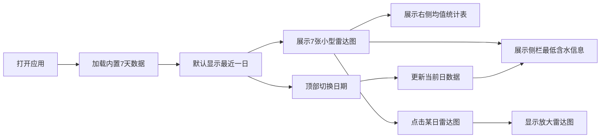

## 1. 产品概述
春雨期农技站田块表层含水率监测对比工具，用于快速比对多块试验田含水率是否跌破警戒线。
- 目标用户：农技站工作人员、农业科研人员
- 核心价值：可视化展示多田块连续含水率数据，辅助快速决策

## 2. 核心功能

### 2.1 用户角色
| 角色 | 注册方法 | 核心权限 |
|------|----------|----------|
| 农技人员 | 无需注册，离线使用 | 查看数据、切换日期、放大雷达图 |

### 2.2 功能模块
1. **主雷达图区**：7张小型雷达图按日排列，5顶点对应5块试验田
2. **放大雷达图**：点击某日显示该日放大雷达图
3. **日期切换导航**：顶部切换当前查看日，默认最近一日
4. **均值统计表**：右侧展示各田块7日均值，<18%标橙警示
5. **最低含水侧栏**：显示当前日含水最低田块及数值

### 2.3 页面详情
| 页面名称 | 模块名称 | 功能描述 |
|-----------|-------------|---------------------|
| 首页 | 顶部导航栏 | 日期切换按钮组，显示7天日期，当前日高亮 |
| 首页 | 主雷达图区 | 7张迷你雷达图横向排列，可点击放大 |
| 首页 | 放大雷达图 | 点击小型图后显示详细雷达图，带数值标签 |
| 首页 | 均值统计表 | 右侧表格展示5块田7日均值，低于18%橙色高亮 |
| 首页 | 侧栏信息卡 | 左侧/右侧显示当前日最低含水田块信息 |

## 3. 核心流程
用户打开应用 → 默认显示最近一日数据 → 查看7天雷达图概览 → 点击某日放大查看 → 通过顶部导航切换日期 → 查看均值表识别低含水田块 → 侧栏快速了解最低值田块

## 4. 用户界面设计

### 4.1 设计风格
- **主色调**：深青色(#0F4C5C) - 体现专业、农业监测
- **辅助色**：橙红色(#E36414) - 警戒线警示色，<18%时使用
- **强调色**：青绿色(#5FA8D3) - 水相关、正常状态
- **背景**：渐变浅青色到白色，带细微颗粒纹理
- **字体**：标题使用"Noto Serif SC"，正文使用"Noto Sans SC"
- **布局**：顶部导航 + 左侧侧栏 + 中间主区 + 右侧表格的四栏布局
- **卡片风格**：微圆角(8px)、柔和阴影、悬停轻微上浮

### 4.2 页面设计概述
| 页面名称 | 模块名称 | UI 元素 |
|-----------|-------------|-------------|
| 首页 | 顶部导航栏 | 日期胶囊按钮组，当前日背景主色，悬停微动效 |
| 首页 | 主雷达图区 | 7张卡片等宽排列，网格布局，悬停阴影加深 |
| 首页 | 放大雷达图 | 居中模态或内联放大，带渐变填充，顶点显示数值 |
| 首页 | 均值统计表 | 斑马纹行，低含水行橙色背景，数值右对齐 |
| 首页 | 侧栏信息卡 | 大号数值显示，田块名称醒目，图标辅助 |

### 4.3 响应式
- Desktop-first 设计，1280px 以上最佳展示
- 中等屏幕(1024px)：侧栏折叠为顶部信息条
- 小屏幕(768px)：雷达图改为纵向排列，表格堆叠下方
- 触控优化：点击区域≥44px，按钮状态反馈明确

### 4.4 动效设计
- 页面加载：各模块按顺序淡入（导航→侧栏→雷达图→表格）
- 雷达图绘制：数值从0动画到目标值
- 日期切换：平滑过渡当前高亮
- 悬停效果：卡片轻微上浮(translateY(-2px))，阴影加深
- 放大动画：从小雷达图位置平滑过渡到放大尺寸
