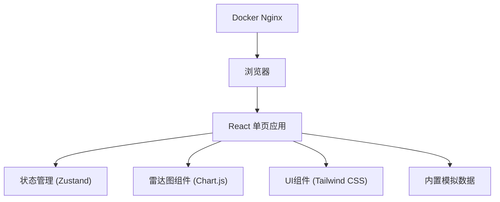
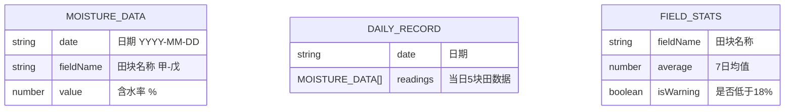

## 1. 架构设计
纯前端静态应用，数据内置离线可用。无后端依赖，可通过Docker静态发布。



## 2. 技术描述
- **前端框架**：React@18 + TypeScript@5 + Vite@5
- **图表库**：Chart.js@4 + react-chartjs-2@5
- **状态管理**：Zustand@4
- **样式方案**：Tailwind CSS@3
- **图标库**：Lucide React@0.400
- **Docker**：Nginx Alpine 静态托管
- **数据**：内置JSON模拟数据，离线可用

## 3. 目录结构
```
src/
├── components/
│   ├── RadarChart.tsx      # 雷达图组件（支持大小模式）
│   ├── DateNavigator.tsx   # 顶部日期导航
│   ├── StatsTable.tsx      # 均值统计表
│   ├── SidebarInfo.tsx     # 侧栏最低含水信息
│   └── RadarGrid.tsx       # 7张雷达图网格
├── data/
│   └── moistureData.ts     # 内置7天含水率数据
├── store/
│   └── useAppStore.ts      # Zustand状态管理
├── types/
│   └── index.ts            # TypeScript类型定义
├── utils/
│   └── calculations.ts     # 计算工具函数（均值、最低值等）
├── App.tsx
├── main.tsx
└── index.css
```

## 4. 路由定义
| 路由 | 用途 |
|-------|---------|
| / | 首页，展示完整雷达对比界面 |

## 5. 数据模型

### 5.1 数据结构定义


### 5.2 TypeScript 类型定义
```typescript
export interface FieldReading {
  fieldName: string; // 甲、乙、丙、丁、戊
  value: number;     // 含水率 %
}

export interface DailyData {
  date: string;      // YYYY-MM-DD
  readings: FieldReading[];
}

export interface FieldStats {
  fieldName: string;
  average: number;
  isWarning: boolean;
}

export interface LowestField {
  fieldName: string;
  value: number;
  date: string;
}

export interface AppState {
  selectedDate: string;
  zoomedDate: string | null;
  dailyData: DailyData[];
}
```

### 5.3 内置模拟数据
- 7天数据，日期从2026-06-11到2026-06-17
- 5块田：甲、乙、丙、丁、戊
- 含水率范围：15%-25%，部分日期低于18%触发警告
- 数据设计体现春雨期变化趋势，有2-3块田均值低于警戒线

## 6. 状态管理
使用 Zustand 管理应用状态：
```typescript
interface AppStore {
  selectedDate: string;
  zoomedDate: string | null;
  setSelectedDate: (date: string) => void;
  setZoomedDate: (date: string | null) => void;
  getSelectedDayData: () => DailyData | undefined;
  getFieldAverages: () => FieldStats[];
  getLowestField: () => LowestField | null;
}
```

## 7. Docker 发布
- 使用 `nginx:alpine` 镜像
- 构建产物 `dist/` 目录复制到 `/usr/share/nginx/html`
- 暴露 80 端口
- 支持离线运行，无外部依赖
